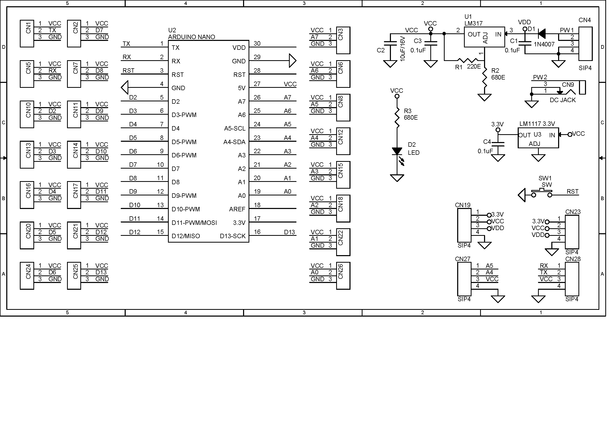

**Arduino Nano Expansion Shield**

If you need to interface many devices and sensors to Arduino Nano, then, this project is for you. This is a Nano expansion I/O shield (breakout board) for the Arduino Nano. The board facilitates the easy connection between Arduino Nano and other devices.  Each Arduino (I/O) Pin including the 5V DC and GND pins are available for easy connection to the sensors and other devices. The board enables the easy interface of many devices and sensors which includes various power voltage options. It provides several different options for power outputs and wide range of operating power supply input.

**Features**
<ul>
<li>All I/O pins including 5V DC and GND Pins (5V-I/0-GND)</li>
<li>On-Board TX/RX/5V/GND Connector for Serial Interface</li>
<li>On-Board I2C Connector (A5SCL- A4SDA-5V-GND)</li>
<li>2x Connector for Power Output: VD (Input Supply After Diode), 5V DC, 3.3V DC)</li>
<li>Supply Input 7V to 24V DC Using DC Jack or Header Connector</li>
<li>On-Board 5V Regulator L317-Adj (Output Set to 5V)</li>
<li>On-Board 3.3V Regulator LM1117-3.3V</li>
<li>On-Board Power LED</li>
<li>On-Board DC Jack for Power Input 7V-24V DC</li>
<li>Reverse Supply Protection Diode on Power Input</li>
<li>Optional 4 Pin Header Connector for Power Input</li>
<li>On-Board Reset Switch</li>
<li>PCB Dimensions 62.55 x 48.90mm</li>
</ul>

**Schematic**

**B.O.M.**

**PDF**
<object data="../images/Expansion-Shield-Breakout-Board-for-Arduino-Nano.pdf" type="application/pdf" width="1024px" height="800px">
    <embed src="../images/Expansion-Shield-Breakout-Board-for-Arduino-Nano.pdf">
        
This browser does not support PDFs. Please download the PDF to view it: <a href="https://github.com/ROBOTICronics/PCB/images/Expansion-Shield-Breakout-Board-for-Arduino-Nano.pdf">Download PDF</a>.

    </embed>
</object>

TOP

BOTTOM

SILKSCREEN

