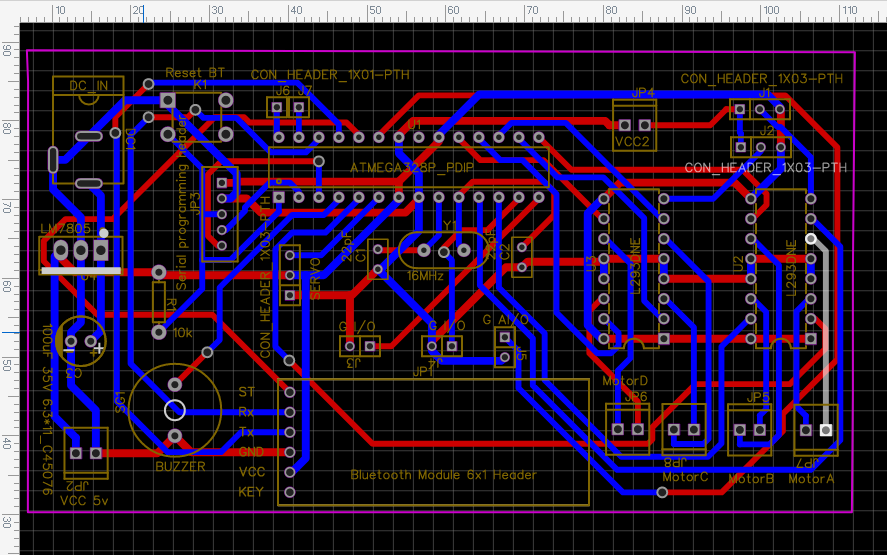

Four holes (drilled on rectangle 89.0 x 62.0 mm) configure external PCB board dimensions at 100.0 x 75.0 mm

____

___

____

## B.O.M. ##
| Name                          | Designator    | Quantity |
|-------------------------------|---------------|----------|
| "22pF"                        | "C1,C2"       | "2"      |
| "100uF 35V 6.3*11_C45076"     | "C3"          | "1"      |
| "DC_IN"                       | "DC1"         | "1"      |
| "CON_HEADER_1X03-PTH"         | "J1,J2,SERVO" | "3"      |
| "G I/O"                       | "J3,J4"       | "2"      |
| "G AI/O"                      | "J5"          | "1"      |
| "CON_HEADER_1X01-PTH"         | "J6,J7"       | "2"      |
| "Bluetooth Module 6x1 Header" | "JP1"         | "1"      |
| "VCC 5v"                      | "JP2"         | "1"      |
| "Serial programming header"   | "JP3"         | "1"      |
| "VCC2"                        | "JP4"         | "1"      |
| "MotorB"                      | "JP5"         | "1"      |
| "MotorD"                      | "JP6"         | "1"      |
| "MotorA"                      | "JP7,JP8"     | "2"      |
| "Reset BT"                    | "K1"          | "1"      |
| "10k"                         | "R1"          | "1"      |
| "BUZZER"                      | "SG1"         | "1"      |
| "ATMEGA328P_PDIP"             | "U1"          | "1"      |
| "L293DNE"                     | "U2,U3"       | "2"      |
| "LM7805"                      | "U4"          | "1"      |
| "16MHz"                       | "Y1"          | "1"      |
