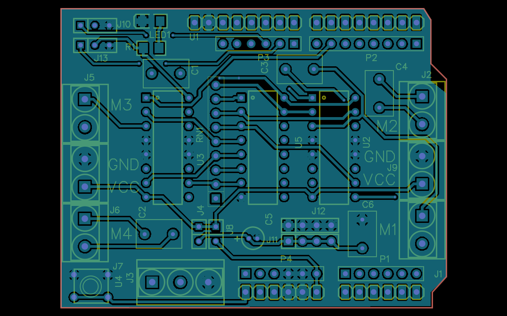
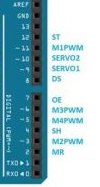
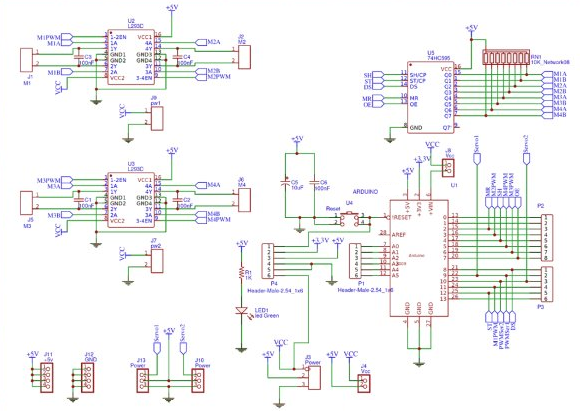

____

____

___

____

## B.O.M. ##
| Name                     | Designator     | Footprint         | Quantity |
|--------------------------|----------------|-------------------|----------|
| ARDUINO                  | U1             | ARDUINO           | 1        |
| L293D                    | U2,U3          | DIP16             | 2        |
| +5v                      | J11            | M1X4              | 1        |
| GND                      | J12            | M1X4              | 1        |
| Power                    | J13,J10        | M1X3              | 2        |
| 100nF                    | C3,C4,C1,C2,C6 | RAD-0.2           | 5        |
| Power                    | J3             | H3-5.0-15.5X8.0MM | 1        |
| M1                       | J1             | H2-5.0-10.5X8.0MM | 1        |
| M2                       | J2             | H2-5.0-10.5X8.0MM | 1        |
| Vcc                      | J4,J8          | M1X2              | 2        |
| pw1                      | J9             | H2-5.0-10.5X8.0MM | 1        |
| M3                       | J5             | H2-5.0-10.5X8.0MM | 1        |
| M4                       | J6             | H2-5.0-10.5X8.0MM | 1        |
| pw2                      | J7             | H2-5.0-10.5X8.0MM | 1        |
| 74HC595                  | U5             | DIP16             | 1        |
| 10uF                     | C5             | CAP-D4.0XF1.5     | 1        |
| Header-Male-2.54_1x6     | P1,P3,P4       | HDR-6X1/2.54      | 3        |
| 10K_Network08            | RN1            | R_ARRAY_SIP9      | 1        |
| Female headerHDR1X8-2.54 | P2             | HDR-8X1/2.54      | 1        |
| Reset                    | U4             | SWITCH-6X6X5_TH   | 1        |
| led Green                | LED1           | LED-1206          | 1        |
| _                        | R1             | 1206              | 1        |
