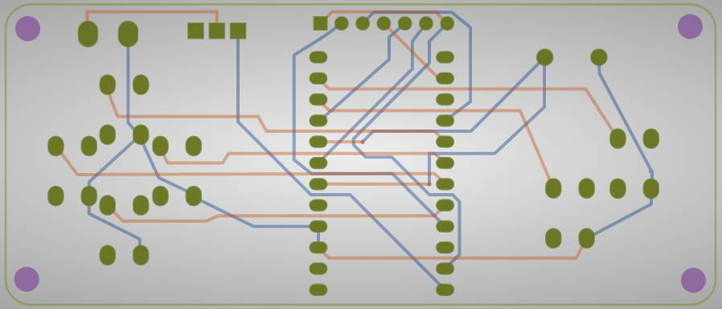
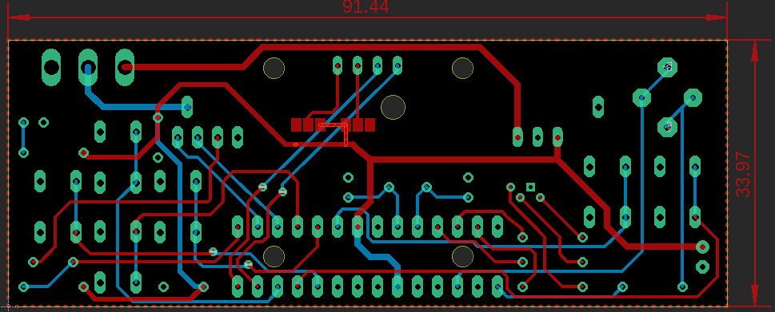

# Development Boards for playfulness (PCB view)
## 1.  Essential PCB
  - **using OLEDs** -
  - 
  - [PCB board](https://github.com/ROBOTICronics/PCB/tree/main/xMM/learnOLEDs.zip "download LearnOLEDs PCB")
## 2.  StandardPCB
  - **w/ ATMEGA328P**
  - 
  - [PCB board](https://github.com/ROBOTICronics/PCB/tree/main/xMM/wATMEGA328P.zip "download wATMEGA328P PCB")
